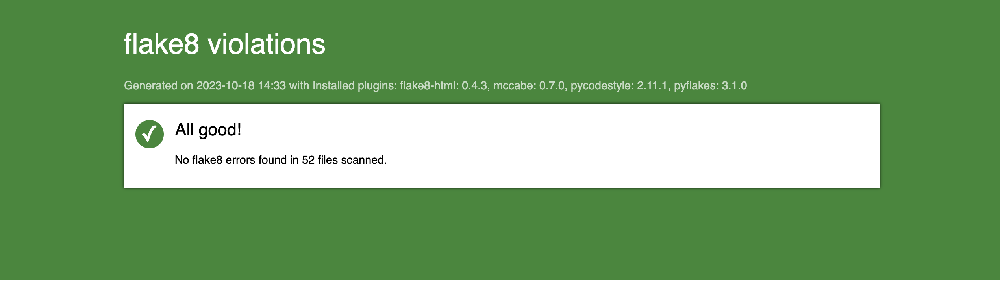
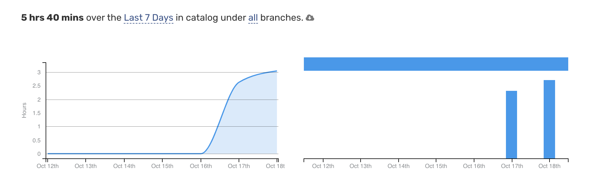

# Catalog

## Оглавление

- [Технологии](#технологии)
- [API документация](#api-документация)
- [Flake8](#flake8)
---

## Технологии

- DRF (Django Rest Framework)
- Jazzmin (для кастомизации админ-панели Django)
- Pytest (для тестирования)

---

## API документация

Подробная документация по API доступна по 
- [Swagger](http://localhost:8000/api/v1/swagger/)
- [Redoc](http://localhost:8000/api/v1/redoc/)

---

## Flake8

---

## Wakatime Report

5 часов 40 минут